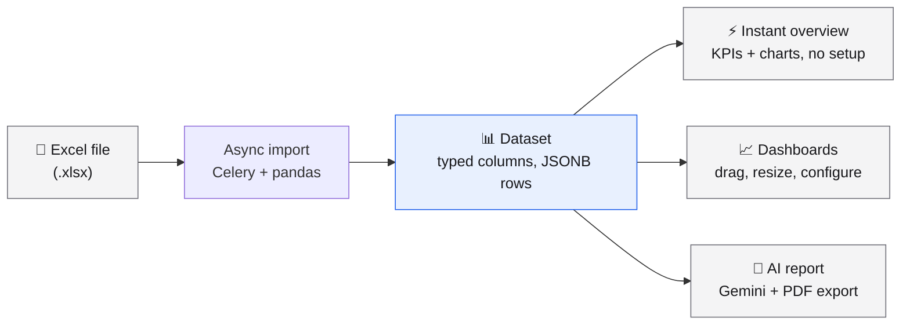
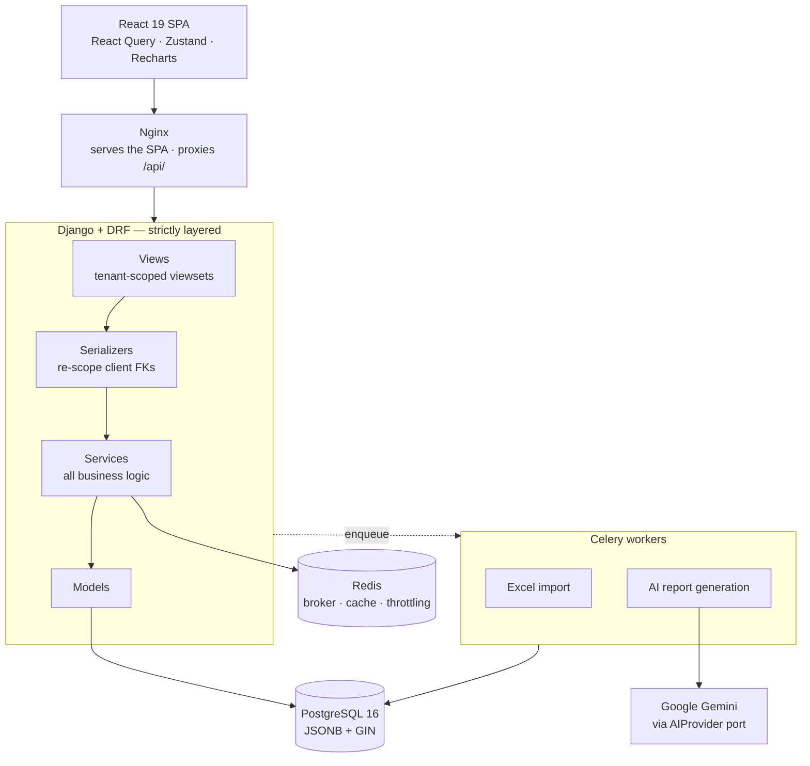

<div align="center">

# Novus RA Intelligence

**Turn the spreadsheets a business already lives in into dashboards, KPIs, and AI-written reports — without hiring a data team.**

Upload an Excel file. Get a queryable dataset, an instant visual overview, editable dashboards, and an executive summary written by AI.

[](LICENSE)
[](https://github.com/deyby01/novus-ra-intelligence/actions/workflows/ci.yml)
[](https://www.python.org/)
[](https://www.djangoproject.com/)
[](https://react.dev/)
[](docs/CONTRIBUTING.md)

</div>

---

## The problem

Small and mid-sized businesses run on spreadsheets. Sales in one workbook, inventory in another, expenses in a third — each one owned by a different person, none of them talking to each other. The data needed to make a decision exists, but answering "how did we actually do last quarter?" means an afternoon of copying columns into pivot tables.

Business intelligence tools exist, but they assume you already have a data warehouse, a modelling layer, and someone who knows how to use them. That is a team an SMB does not have.

**Novus RA Intelligence closes that gap.** It takes the file the business already maintains and turns it into something you can look at, query, and share — including a written interpretation of what the numbers say.

## What it does



### Import that survives real spreadsheets

Drop in an `.xlsx` file. The import runs asynchronously through Celery, so a large workbook never blocks the browser, and it reports progress through an `ImportJob` state machine. Column types are inferred from the data (number, date, text, boolean), blank rows and phantom columns are trimmed, and a malformed file produces a readable error instead of a stack trace. Rows are stored as JSONB with a GIN index, so a dataset can have any shape without a migration.

### An overview before you configure anything

The moment an import finishes, the dataset already has a visual summary: headline KPIs, a distribution chart, a breakdown by the most meaningful categorical column. No widget picker, no blank canvas. The same engine that builds this overview also powers AI dashboard generation, so what you see first is what you can keep.

### Dashboards you actually edit

Build dashboards from any dataset with line, bar, pie, KPI, and table widgets. Resize any widget by dragging its corner, reorder by dragging it into place, and edit its configuration in place. Aggregation happens in the database over JSONB — not in Python, and not in the browser — so widgets stay fast as datasets grow. Or skip the building entirely: point the AI at a dataset and it generates a complete dashboard, named and summarized.

### Reports written in prose

The AI layer reads the actual data — schema, distributions, aggregates — and writes an executive summary of what it finds: trends, outliers, what stands out. Reports render as formatted Markdown in the app and export as a branded PDF generated server-side with WeasyPrint. Gemini sits behind a swappable `AIProvider` port, so the provider can be replaced without touching business logic, and tests inject a fake instead of calling an API.

### Multi-tenant by design

Every organization is a fully isolated workspace. The current organization is resolved server-side from a request header and validated against an active membership on every single request — never trusted from the client. Users switch workspaces from the top bar, and query caches are keyed per organization so nothing leaks across a switch. This is enforced by a dedicated isolation test suite, not by convention.

### The rest of the product

Self-service signup that provisions a user, an organization, and an admin membership atomically · JWT auth with refresh rotation and blacklisting · password reset by email · account settings (display name, password change) · a workspace activity feed · a themed Django admin.

---

## How it works



The backend is strictly layered — `View → Serializer → Service → Model` — with business logic living in services that never import from the API layer. External dependencies are consumed through ports with swappable adapters, so tests inject fakes rather than mocking HTTP. Architecture decisions are written down as [ADRs](docs/adr/) *before* they are implemented; there are 21 of them covering everything from tenant isolation to PDF rendering.

## Tech stack

| Layer | Technology |
|---|---|
| **Backend** | Django 5.2 · Django REST Framework 3.16 · SimpleJWT · django-filter |
| **Frontend** | React 19 · TypeScript (strict) · Vite · Tailwind CSS v4 · shadcn/ui (Radix) · Recharts · React Query · Zustand · React Router 7 |
| **Data** | PostgreSQL 16 (JSONB + GIN for dynamic datasets) · Redis 7 |
| **Async** | Celery 5.4 — Excel imports and AI report generation |
| **AI** | Google Gemini via `google-genai`, behind a swappable `AIProvider` port |
| **Documents** | pandas + openpyxl (import) · WeasyPrint (PDF export) |
| **Testing** | pytest + pytest-django · Vitest + Testing Library + MSW |
| **Tooling** | ruff (lint + format) · ESLint + Prettier · GitHub Actions CI |
| **Infra** | Docker Compose · Nginx |

## Quick start

You need **Docker** and **Docker Compose**. Nothing else — Python, Postgres, and Redis all run in containers.

**1. Clone and configure.**

```bash
git clone https://github.com/deyby01/novus-ra-intelligence.git
cd novus-ra-intelligence
cp .env.example .env
```

Open `.env` and replace the placeholders. `DJANGO_SECRET_KEY` doubles as the JWT signing key, so generate a real one:

```bash
python3 -c "import secrets; print(secrets.token_urlsafe(64))"
```

Set `GEMINI_API_KEY` too if you want the AI features ([free key here](https://aistudio.google.com/apikey)). Everything else works without it.

**2. Start everything.**

```bash
docker compose up -d --build
```

Five services come up: PostgreSQL, Redis, Django, the Celery worker, and Nginx serving the built frontend. Migrations run automatically in development.

**3. Open http://localhost** and sign up. Creating an account provisions your workspace automatically — then import a spreadsheet and watch the overview appear.

| URL | What |
|---|---|
| http://localhost | The application |
| http://localhost:8000/api/v1/ | REST API |
| http://localhost:8000/admin/ | Django admin (needs `createsuperuser`) |

Working on the frontend? The container serves a baked build, so run Vite on your host for hot reload — `cd frontend && npm install && npm run dev` — and use http://localhost:5173. Full setup notes, including the environment gotchas that will bite you, are in the [contributing guide](docs/CONTRIBUTING.md#4-run-it-locally).

## Repository layout

```
├── backend/                  # Django + DRF
│   ├── apps/
│   │   ├── accounts/         # email-based User, JWT auth, profile
│   │   ├── organizations/    # Organization + Membership (multi-tenancy core)
│   │   ├── datasets/         # dynamic datasets, Excel import, aggregation
│   │   ├── dashboards/       # dashboards and chart widgets
│   │   ├── reports/          # AI reports (Gemini) and PDF export
│   │   ├── activity/         # workspace activity feed
│   │   └── core/             # shared base models and mixins
│   ├── config/settings/      # base / dev / test / prod
│   └── requirements/         # base.txt · dev.txt · prod.txt
├── frontend/
│   ├── src/features/         # one folder per feature (components, pages, api, hooks, types)
│   ├── nginx.conf            # serves the SPA and proxies /api/ to Django
│   └── Dockerfile            # multi-stage: Vite build → Nginx
├── docs/
│   ├── adr/                  # 21 architecture decision records
│   ├── erd/                  # database diagram (Mermaid)
│   └── CONTRIBUTING.md       # setup, workflow, and standards
└── docker-compose.yml
```

## Tests and quality gate

Every pull request has to pass the same checks CI runs:

```bash
docker compose run --rm --entrypoint pytest backend
```

```bash
cd frontend && npm test && npm run lint && npm run format:check && npm run build
```

Plus `ruff check .`, `ruff format --check .`, and a `makemigrations --check` that catches model changes without a migration. The full commands are in the [contributing guide](docs/CONTRIBUTING.md#5-run-the-checks-the-gate).

The project follows TDD for services and security-critical logic, with integration tests at the API layer and a dedicated suite proving that one organization cannot reach another's data.

## Documentation

| Document | What's in it |
|---|---|
| [**Contributing guide**](docs/CONTRIBUTING.md) | Fork/clone, local setup, branching, commits, pull requests, code standards |
| [**Architecture decisions**](docs/adr/) | 21 ADRs — why the system is built the way it is |
| [**Database ERD**](docs/erd/core.md) | Entity relationships as a Mermaid diagram |
| [**Multi-tenant isolation**](docs/CONTRIBUTING.md#9-multi-tenant-isolation-security-critical) | How tenant scoping works and what you must do when touching data access |

## Contributing

Contributions are welcome. The short version:

1. **Fork the repo** (or clone it if you have write access) and set up locally with `docker compose up -d --build`.
2. **Branch off `development`** using `feature/<your-github-username>/<specific-feature>` — for example `feature/janedoe/csv-import`. Never commit directly to `development`.
3. **Write in English.** Code, comments, documentation, commit messages, and UI strings — always, without exception.
4. **Run the gate** before pushing: tests, lint, format check, and build, on both backend and frontend.
5. **Open a pull request against `development`.** [@deyby01](https://github.com/deyby01) is added as reviewer automatically via `CODEOWNERS` and is the only one who merges.

Read the [full contributing guide](docs/CONTRIBUTING.md) before your first pull request — it covers the setup gotchas, the commit convention, the code standards, and the tenant-isolation rules that every change touching data access must respect.

## Project status

The product is **complete end to end and pilot-ready**: a new user can sign up, import a spreadsheet, get an instant overview, build dashboards, and generate an AI report with a PDF export. It has not yet been deployed for a production customer, and rule-based automations are planned but deliberately frozen until a real pilot validates the current feature set.

Known work in progress: some UI strings from an earlier design pass are still in Spanish and are being migrated to English feature by feature. New code is English-only.

## License

[MIT](LICENSE) — free to use, modify, and distribute, commercially or otherwise.

<div align="center">
<br>
Built by <a href="https://github.com/deyby01">@deyby01</a>
</div>
