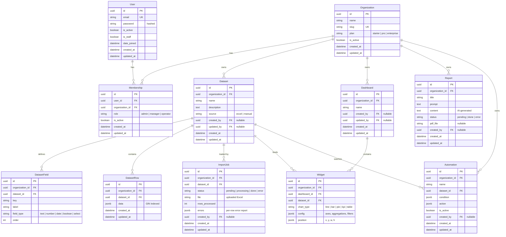

# Core ERD — Novus RA Intelligence

The core database model, synthesized from ADR-0001 through ADR-0009. This is the source of truth we translate into Django models — **read the ADRs for the *why* of each choice**; this file captures the *what*.

> GitHub renders the Mermaid diagram below automatically. Notation is crow's foot: `||` = exactly one, `o{` = zero-or-many. So `Organization ||--o{ Dataset` reads "one Organization owns zero or many Datasets".

## Abstract bases (not tables — mixed into the models)

These are Django abstract models; their fields appear on every table that inherits them.

| Abstract | Adds | Applied to |
|---|---|---|
| `BaseModel` | `id` (UUID PK, ADR-0002), `created_at`, `updated_at` | everything |
| `TenantBaseModel` (`BaseModel`) | `organization` FK (denormalized, ADR-0006) | every tenant-scoped table |
| `AuthoredModel` (mixin) | `created_by`, `updated_by` (nullable FK → User, ADR-0005) | business entities only |

## Diagram

## Constraints & indexes (ADR-0008)

| Table | Rule | Kind |
|---|---|---|
| `Organization` | `slug` unique | constraint |
| `Membership` | `UniqueConstraint(user, organization)` | constraint |
| `DatasetField` | `UniqueConstraint(dataset, key)` | constraint |
| `DatasetRow` | `GinIndex(fields=["data"])` | index |
| all FKs | auto-indexed by Django | index (implicit) |

## Referential actions — `on_delete` (ADR-0009)

| FK | on_delete | Why |
|---|---|---|
| `Membership.user` | CASCADE | membership is part of the user |
| `Membership.organization` | CASCADE | membership is part of the org |
| `Dataset.organization` | CASCADE | ownership |
| `DatasetField.dataset` / `.organization` | CASCADE | ownership |
| `DatasetRow.dataset` / `.organization` | CASCADE | ownership |
| `ImportJob.dataset` / `.organization` | CASCADE | ownership |
| `Dashboard.organization` | CASCADE | ownership |
| `Widget.dashboard` / `.organization` | CASCADE | widget lives in the dashboard |
| `Widget.dataset` | **PROTECT** | can't delete a dataset a widget uses |
| `Report.organization` | CASCADE | ownership |
| `Automation.organization` | CASCADE | ownership |
| `Automation.dataset` | **PROTECT** | can't delete a dataset an automation watches |
| every `created_by` / `updated_by` | SET_NULL | keep the row, drop the author link |

> ⚠️ Because `Widget.dataset` / `Automation.dataset` are `PROTECT`, full tenant deletion is a deliberate, ordered **service operation** (widgets/automations → datasets → org), not a naive `organization.delete()`. See ADR-0009.

## Not modeled yet (future ADRs)

- Fine-grained per-module permissions (plan's `Role` table with JSON permissions) — deferred to Phase 4 (ADR-0004).
- Soft delete (`deleted_at`) — deferred (ADR-0005).
- `Report` ↔ `Dataset` link — additive if needed later (ADR-0006).
- "Current organization" resolution mechanism (header / subdomain / session) — API-design phase (ADR-0004).
